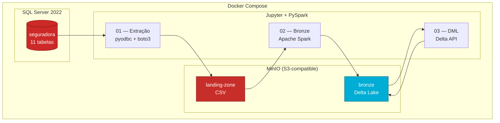
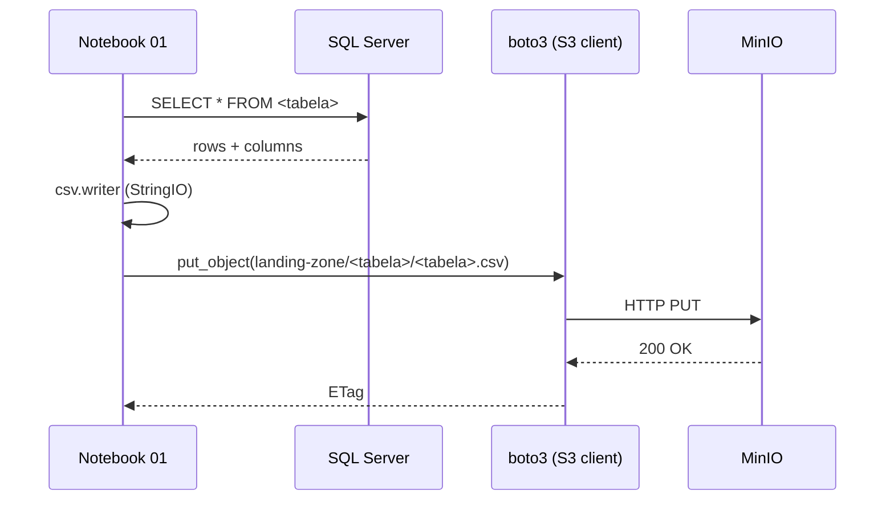

# Arquitetura { .hero-title }

## Visão geral { .reveal }

O pipeline implementa o padrão **Medallion** com duas camadas principais — *landing-zone* (dados brutos em CSV) e *bronze* (dados transacionais em Delta Lake). Toda a comunicação entre serviços acontece dentro de uma rede Docker isolada.



---

## Componentes { .reveal }

<div class="grid cards reveal" markdown>

-   :material-database:{ .lg .middle .accent-sqlserver } &nbsp; __SQL Server 2022__

    ---

    Container `sqlserver`, porta `1433`. Hospeda o banco `seguradora` com 11 tabelas e ~120 registros de carga inicial.

-   :material-cloud-outline:{ .lg .middle .accent-minio } &nbsp; __MinIO__

    ---

    Container `minio`, portas `9000` (API S3) e `9001` (console web). Buckets criados automaticamente pelo `mc-init`.

-   :material-notebook:{ .lg .middle .accent-jupyter } &nbsp; __Jupyter Lab__

    ---

    Container `jupyter`, porta `8888`. Ambiente PySpark com Delta Lake e drivers JDBC pré-instalados.

</div>

---

## Containers Docker { .reveal }

| Container | Imagem | Porta(s) | Função |
|---|---|---|---|
| `sqlserver` | `mcr.microsoft.com/mssql/server:2022-latest` | `1433` | Banco de dados fonte |
| `minio` | `minio/minio:latest` | `9000`, `9001` | Object storage S3-compatible |
| `mc-init` | `minio/mc:latest` | — | Cria buckets `landing-zone` e `bronze` |
| `jupyter` | `quay.io/jupyter/pyspark-notebook` | `8888` | Notebooks PySpark |

---

## Estrutura dos buckets { .reveal }

=== "landing-zone (CSV)"

    ```
    landing-zone/
    ├── apolice/apolice.csv
    ├── carro/carro.csv
    ├── cliente/cliente.csv
    ├── endereco/endereco.csv
    ├── estado/estado.csv
    ├── marca/marca.csv
    ├── modelo/modelo.csv
    ├── municipio/municipio.csv
    ├── regiao/regiao.csv
    ├── sinistro/sinistro.csv
    └── telefone/telefone.csv
    ```

=== "bronze (Delta Lake)"

    ```
    bronze/
    ├── apolice/
    │   ├── part-00000-*.snappy.parquet
    │   └── _delta_log/
    │       ├── 00000000000000000000.json
    │       └── 00000000000000000001.json
    ├── carro/
    ├── cliente/
    └── ... (uma pasta Delta por tabela)
    ```

---

## Fluxo de dados { .reveal }



---

## Configurações relevantes { .reveal }

A `SparkSession` do notebook 02 precisa de algumas configs específicas para falar com o MinIO via protocolo S3A e habilitar o catálogo Delta:

```python
spark = (
    SparkSession.builder
    .appName("csv-to-delta")
    .config("spark.jars.packages",
            "io.delta:delta-spark_2.12:3.2.0,"
            "org.apache.hadoop:hadoop-aws:3.3.4,"
            "com.amazonaws:aws-java-sdk-bundle:1.12.262")
    .config("spark.sql.extensions", "io.delta.sql.DeltaSparkSessionExtension")
    .config("spark.sql.catalog.spark_catalog",
            "org.apache.spark.sql.delta.catalog.DeltaCatalog")
    .config("spark.hadoop.fs.s3a.endpoint", MINIO_ENDPOINT)
    .config("spark.hadoop.fs.s3a.access.key", MINIO_ACCESS_KEY)
    .config("spark.hadoop.fs.s3a.secret.key", MINIO_SECRET_KEY)
    .config("spark.hadoop.fs.s3a.path.style.access", "true")
    .config("spark.hadoop.fs.s3a.connection.ssl.enabled", "false")
    .getOrCreate()
)
```

| Configuração | Por que importa |
|---|---|
| `delta-spark_2.12:3.2.0` | Habilita o formato Delta no Spark |
| `hadoop-aws:3.3.4` | Driver S3A para acesso ao MinIO |
| `path.style.access=true` | MinIO usa path-style, não virtual-host |
| `connection.ssl.enabled=false` | Comunicação interna entre containers em HTTP |
