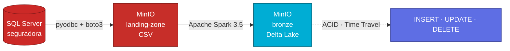
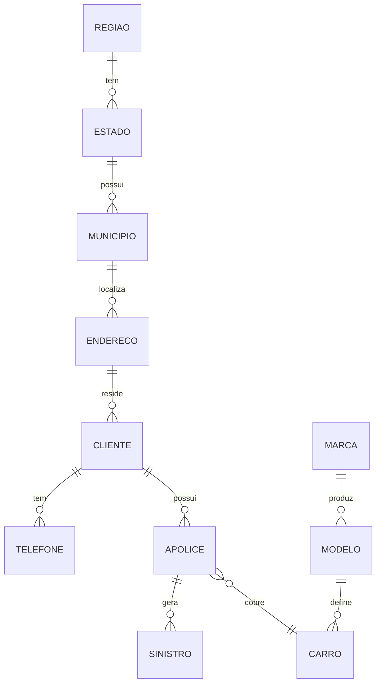

# Apache Spark com MinIO e SQL Server { .hero-title }

## Sobre o trabalho { .reveal }

Este é o **Trabalho 2** da disciplina de Arquitetura de Dados. O objetivo é construir um pipeline completo seguindo a **arquitetura Medallion**, utilizando **Apache Spark (PySpark)** para extração e transformação, **SQL Server** como banco fonte, **MinIO** como object storage compatível com S3 e **Delta Lake** como formato de tabela aberta com suporte a transações ACID.

Toda a infraestrutura sobe via Docker Compose — não é necessário instalar Java, Spark ou Python localmente.

!!! info "Escopo"
    Este trabalho **não** implementa Apache Iceberg. A conversão para Iceberg é requisito exclusivo do Trabalho 1.

---

## Stack utilizada { .reveal }

-   :material-database:{ .lg .middle .accent-sqlserver } &nbsp; __SQL Server 2022__

    ---

    Banco de dados fonte com 11 tabelas relacionais do domínio `seguradora`

-   :material-cloud-outline:{ .lg .middle .accent-minio } &nbsp; __MinIO__

    ---

    Object storage compatível com S3, hospedando os buckets `landing-zone` e `bronze`

-   :material-fire:{ .lg .middle .accent-spark } &nbsp; __Apache Spark 3.5__

    ---

    Engine de processamento distribuído, lê CSV e grava Delta no MinIO via S3A

-   :material-layers-triple:{ .lg .middle .accent-delta } &nbsp; __Delta Lake 3.2__

    ---

    Open table format com ACID, Time Travel e DML nativo (INSERT/UPDATE/DELETE)

-   :material-language-python:{ .lg .middle .accent-python } &nbsp; __Python + pyodbc + boto3__

    ---

    Extração das tabelas do SQL Server e upload em CSV para o MinIO

-   :material-docker:{ .lg .middle .accent-docker } &nbsp; __Docker Compose__

    ---

    Orquestração dos containers SQL Server, MinIO e Jupyter Lab

---

## Pipeline { .reveal }

| Camada | Bucket | Formato | Descrição |
|---|---|---|---|
| **Landing Zone** | `landing-zone` | CSV | Dados brutos extraídos do SQL Server |
| **Bronze** | `bronze` | Delta Lake | Dados em formato transacional com DML nativo |

---

## Banco de dados — seguradora { .reveal }

O banco `seguradora` modela um sistema de **seguro de automóveis** com 11 tabelas relacionais.

| Tabela | Registros | Descrição |
|---|---|---|
| `regiao` | 5 | Regiões do Brasil |
| `estado` | 15 | Estados brasileiros |
| `municipio` | 10 | Municípios |
| `endereco` | 10 | Endereços dos clientes |
| `cliente` | 10 | Clientes da seguradora |
| `telefone` | 10 | Telefones de contato |
| `marca` | 8 | Marcas de veículos |
| `modelo` | 15 | Modelos de veículos |
| `carro` | 10 | Veículos segurados |
| `apolice` | 10 | Apólices de seguro |
| `sinistro` | 8 | Sinistros registrados |

---

## Notebooks { .reveal }

A execução do pipeline é feita em quatro notebooks, executados em ordem:

-   :material-database-cog:{ .lg .middle .accent-sqlserver } &nbsp; __00 — Setup SQL Server__

    ---

    Cria o banco `seguradora`, as 11 tabelas e importa os CSVs da pasta `data/`

    [:octicons-arrow-right-24: Detalhes](notebooks/00_setup.md)

-   :material-export:{ .lg .middle .accent-minio } &nbsp; __01 — Extração para landing-zone__

    ---

    Lê todas as tabelas via `pyodbc` e faz upload para o MinIO como CSV via `boto3`

    [:octicons-arrow-right-24: Detalhes](notebooks/01_extracao.md)

-   :material-layers-triple:{ .lg .middle .accent-delta } &nbsp; __02 — Bronze Delta__

    ---

    Lê os CSVs com Spark e converte para Delta Lake no bucket `bronze`

    [:octicons-arrow-right-24: Detalhes](notebooks/02_bronze.md)

-   :material-database-edit:{ .lg .middle .accent-bronze } &nbsp; __03 — DML no Delta__

    ---

    INSERT, UPDATE, DELETE e Time Travel sobre as tabelas Delta

    [:octicons-arrow-right-24: Detalhes](notebooks/03_dml.md)

---

## Referências { .reveal }

- [Apache Spark — Documentação Oficial](https://spark.apache.org/docs/latest/)
- [Delta Lake — Documentação Oficial](https://docs.delta.io/latest/index.html)
- [MinIO — Documentação Oficial](https://min.io/docs/minio/linux/index.html)
- [Repositório modelo — spark-delta-minio-sqlserver (jlsilva01)](https://github.com/jlsilva01/spark-delta-minio-sqlserver)
- [Canal DataWay BR](https://www.youtube.com/@DataWayBR)
