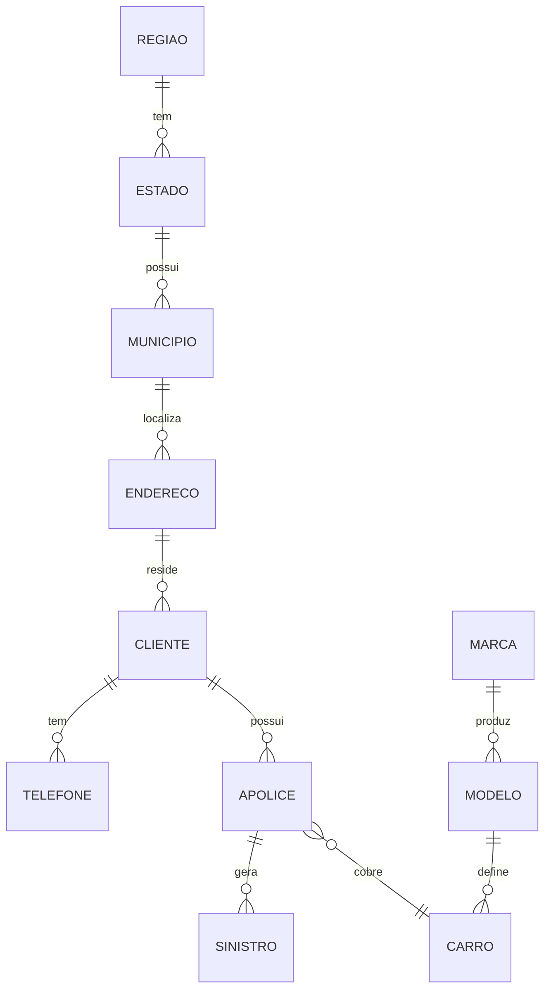

# 00 — Setup SQL Server { .hero-title }

## O que este notebook faz { .reveal }

Cria o banco `seguradora` no SQL Server, define a DDL das 11 tabelas relacionais e popula cada uma a partir dos arquivos CSV da pasta `data/`. É o ponto de partida do pipeline — nada além dele toca o SQL Server diretamente.

!!! tip "Pré-requisito"
    O container `sqlserver` precisa estar saudável. Aguarde ~30 segundos após `docker-compose up -d` para o SQL Server terminar de inicializar.

---

## Etapas { .reveal }

<div class="grid cards reveal" markdown>

-   :material-database-plus:{ .lg .middle .accent-sqlserver } &nbsp; __1. Criar o banco__

    ---

    `CREATE DATABASE seguradora` via conexão `master`

-   :material-table-large:{ .lg .middle .accent-sqlserver } &nbsp; __2. DDL das tabelas__

    ---

    11 tabelas com PKs, FKs e tipagem apropriada

-   :material-file-import:{ .lg .middle .accent-csv } &nbsp; __3. Importar CSVs__

    ---

    `csv.DictReader` + `cursor.execute(INSERT ...)` por linha

-   :material-check-circle:{ .lg .middle .accent-spark } &nbsp; __4. Validar contagens__

    ---

    `SELECT COUNT(*)` de cada tabela para conferência

</div>

---

## Modelo relacional { .reveal }



---

## Conexão { .reveal }

```python
import os
import pyodbc
from dotenv import load_dotenv

load_dotenv()

cn = pyodbc.connect(
    f"DRIVER={{ODBC Driver 18 for SQL Server}};"
    f"SERVER={os.getenv('SQLSERVER_HOST')},{os.getenv('SQLSERVER_PORT')};"
    f"DATABASE=master;"
    f"UID={os.getenv('SQLSERVER_USER')};"
    f"PWD={os.getenv('SQLSERVER_PASSWORD')};"
    f"TrustServerCertificate=yes;",
    autocommit=True,
)
cursor = cn.cursor()
```

---

## Criação do banco { .reveal }

```python
DB = "seguradora"

cursor.execute(f"""
    IF NOT EXISTS (SELECT name FROM sys.databases WHERE name = '{DB}')
        CREATE DATABASE {DB}
""")
cursor.execute(f"USE {DB}")
```

---

## DDL — exemplo { .reveal }

```sql
CREATE TABLE cliente (
    id_cliente   INT PRIMARY KEY,
    nome         VARCHAR(100) NOT NULL,
    cpf          VARCHAR(14)  NOT NULL UNIQUE,
    data_nasc    DATE,
    email        VARCHAR(100),
    id_endereco  INT FOREIGN KEY REFERENCES endereco(id_endereco)
);

CREATE TABLE apolice (
    id_apolice    INT PRIMARY KEY,
    id_cliente    INT FOREIGN KEY REFERENCES cliente(id_cliente),
    id_carro      INT FOREIGN KEY REFERENCES carro(id_carro),
    cobertura     VARCHAR(20),
    valor_premio  DECIMAL(10, 2),
    data_inicio   DATE,
    data_fim      DATE
);
```

---

## Importação dos CSVs { .reveal }

```python
import csv

def importar(tabela: str, arquivo: str, colunas: list[str]):
    placeholders = ",".join("?" * len(colunas))
    sql = f"INSERT INTO {tabela} ({','.join(colunas)}) VALUES ({placeholders})"

    with open(f"/data/{arquivo}", encoding="utf-8") as f:
        reader = csv.DictReader(f)
        for row in reader:
            cursor.execute(sql, [row[c] for c in colunas])

    cn.commit()
```

---

## Conferência { .reveal }

```python
for t in ["regiao", "estado", "municipio", "endereco", "cliente",
          "telefone", "marca", "modelo", "carro", "apolice", "sinistro"]:
    cursor.execute(f"SELECT COUNT(*) FROM {t}")
    print(f"{t:12s} → {cursor.fetchone()[0]} linhas")
```

| Tabela | Esperado |
|---|---|
| `regiao` | 5 |
| `estado` | 15 |
| `municipio` | 10 |
| `endereco` | 10 |
| `cliente` | 10 |
| `telefone` | 10 |
| `marca` | 8 |
| `modelo` | 15 |
| `carro` | 10 |
| `apolice` | 10 |
| `sinistro` | 8 |
