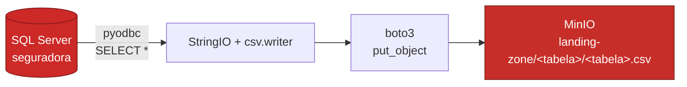

# 01 — Extração: SQL Server → landing-zone { .hero-title }

## O que este notebook faz { .reveal }

Lê todas as tabelas do banco `seguradora` via `pyodbc`, serializa cada uma como CSV em memória e faz upload para o bucket `landing-zone` do MinIO usando `boto3`. É a primeira etapa da arquitetura Medallion — *raw ingestion*, sem transformação alguma.



---

## Mapeamento origem → destino { .reveal }

| Origem | Destino |
|---|---|
| `seguradora.regiao` | `landing-zone/regiao/regiao.csv` |
| `seguradora.estado` | `landing-zone/estado/estado.csv` |
| `seguradora.municipio` | `landing-zone/municipio/municipio.csv` |
| ... | ... |
| `seguradora.sinistro` | `landing-zone/sinistro/sinistro.csv` |

A pasta intermediária com o nome da tabela facilita listagem e leitura pelo Spark no notebook seguinte.

---

## Cliente S3 (boto3) { .reveal }

```python
import os
import boto3
from dotenv import load_dotenv

load_dotenv()

s3 = boto3.client(
    "s3",
    endpoint_url=os.getenv("MINIO_ENDPOINT"),
    aws_access_key_id=os.getenv("MINIO_ACCESS_KEY"),
    aws_secret_access_key=os.getenv("MINIO_SECRET_KEY"),
    region_name="us-east-1",
)

LANDING = os.getenv("MINIO_LANDING_BUCKET", "landing-zone")
```

---

## Loop de extração { .reveal }

```python
import csv, io, pyodbc

cn = pyodbc.connect(
    f"DRIVER={{ODBC Driver 18 for SQL Server}};"
    f"SERVER={os.getenv('SQLSERVER_HOST')},{os.getenv('SQLSERVER_PORT')};"
    f"DATABASE={os.getenv('SQLSERVER_DB')};"
    f"UID={os.getenv('SQLSERVER_USER')};"
    f"PWD={os.getenv('SQLSERVER_PASSWORD')};"
    f"TrustServerCertificate=yes;"
)
cursor = cn.cursor()

TABELAS = ["regiao", "estado", "municipio", "endereco", "cliente",
           "telefone", "marca", "modelo", "carro", "apolice", "sinistro"]

for table in TABELAS:
    cursor.execute(f"SELECT * FROM {table}")
    cols = [c[0] for c in cursor.description]
    rows = cursor.fetchall()

    buf = io.StringIO()
    writer = csv.writer(buf)
    writer.writerow(cols)
    writer.writerows(rows)

    payload = buf.getvalue().encode("utf-8")
    key = f"{table}/{table}.csv"

    s3.put_object(
        Bucket=LANDING,
        Key=key,
        Body=io.BytesIO(payload),
        ContentType="text/csv",
    )
    print(f"✓ {table:12s} → s3://{LANDING}/{key} ({len(rows)} linhas)")
```

---

## Verificação { .reveal }

Lista os objetos do bucket após a extração:

```python
resp = s3.list_objects_v2(Bucket=LANDING)
for obj in resp.get("Contents", []):
    print(f"{obj['Key']:50s} {obj['Size']} bytes")
```

Saída esperada:

```
apolice/apolice.csv          ~1.2 KB
carro/carro.csv              ~0.9 KB
cliente/cliente.csv          ~1.5 KB
...
sinistro/sinistro.csv        ~0.8 KB
telefone/telefone.csv        ~0.4 KB
```

!!! note "Por que CSV?"
    A camada *landing-zone* é o ponto de entrada do data lake. CSV mantém os dados em formato de texto, fáceis de inspecionar, antes de qualquer conversão para formatos colunares (Parquet/Delta) na bronze.
