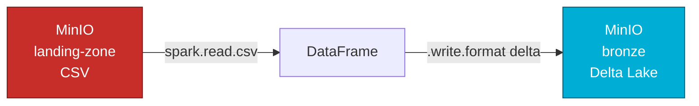

# 02 — Bronze: landing-zone → Delta Lake { .hero-title }

## O que este notebook faz { .reveal }

Lê os CSVs do bucket `landing-zone` com **Apache Spark** e grava cada tabela no bucket `bronze` no formato **Delta Lake**. É aqui que os dados deixam de ser "arquivos soltos" e passam a viver em uma estrutura transacional.



---

## Por que Delta Lake? { .reveal }

O Parquet puro não suporta `UPDATE` nem `DELETE` — para modificar dados gravados seria preciso reescrever arquivos manualmente. O Delta Lake adiciona uma camada de **transaction log** (`_delta_log/`) sobre os Parquets, garantindo:

<div class="grid cards reveal" markdown>

-   :material-shield-check:{ .lg .middle .accent-delta } &nbsp; __Transações ACID__

    ---

    Operações atômicas, sem estados parciais

-   :material-history:{ .lg .middle .accent-delta } &nbsp; __Time Travel__

    ---

    Consulta qualquer versão anterior da tabela

-   :material-lock:{ .lg .middle .accent-delta } &nbsp; __Schema enforcement__

    ---

    Bloqueia gravação com schema divergente por padrão

-   :material-merge:{ .lg .middle .accent-delta } &nbsp; __MERGE (UPSERT)__

    ---

    Combina INSERT e UPDATE em uma única operação

</div>

---

## Estrutura final no MinIO { .reveal }

```
bronze/
├── apolice/
│   ├── part-00000-*.snappy.parquet
│   └── _delta_log/
│       └── 00000000000000000000.json   ← carga inicial
├── carro/
├── cliente/
└── ... (uma pasta Delta por tabela)
```

---

## SparkSession com Delta + S3A { .reveal }

```python
import os
from pyspark.sql import SparkSession
from dotenv import load_dotenv

load_dotenv()

MINIO_ENDPOINT  = os.getenv("MINIO_ENDPOINT")
ACCESS_KEY      = os.getenv("MINIO_ACCESS_KEY")
SECRET_KEY      = os.getenv("MINIO_SECRET_KEY")

spark = (
    SparkSession.builder
    .appName("csv-to-delta")
    .config("spark.jars.packages",
            "io.delta:delta-spark_2.12:3.2.0,"
            "org.apache.hadoop:hadoop-aws:3.3.4,"
            "com.amazonaws:aws-java-sdk-bundle:1.12.262")
    .config("spark.sql.extensions", "io.delta.sql.DeltaSparkSessionExtension")
    .config("spark.sql.catalog.spark_catalog",
            "org.apache.spark.sql.delta.catalog.DeltaCatalog")
    .config("spark.hadoop.fs.s3a.endpoint", MINIO_ENDPOINT)
    .config("spark.hadoop.fs.s3a.access.key", ACCESS_KEY)
    .config("spark.hadoop.fs.s3a.secret.key", SECRET_KEY)
    .config("spark.hadoop.fs.s3a.path.style.access", "true")
    .config("spark.hadoop.fs.s3a.connection.ssl.enabled", "false")
    .getOrCreate()
)
```

---

## Conversão CSV → Delta { .reveal }

```python
LANDING = "s3a://landing-zone"
BRONZE  = "s3a://bronze"

TABELAS = ["regiao", "estado", "municipio", "endereco", "cliente",
           "telefone", "marca", "modelo", "carro", "apolice", "sinistro"]

for tabela in TABELAS:
    src  = f"{LANDING}/{tabela}/{tabela}.csv"
    dest = f"{BRONZE}/{tabela}"

    df = (
        spark.read
        .option("header", "true")
        .option("inferSchema", "true")
        .csv(src)
    )

    (
        df.write
        .format("delta")
        .mode("overwrite")
        .save(dest)
    )

    count = spark.read.format("delta").load(dest).count()
    print(f"✓ {tabela:12s} → {dest} ({count} linhas)")
```

---

## Validação { .reveal }

```python
df_apolice = spark.read.format("delta").load(f"{BRONZE}/apolice")
df_apolice.printSchema()
df_apolice.show(5)
```

```
root
 |-- id_apolice: integer (nullable = true)
 |-- id_cliente: integer (nullable = true)
 |-- id_carro: integer (nullable = true)
 |-- cobertura: string (nullable = true)
 |-- valor_premio: double (nullable = true)
 |-- data_inicio: date (nullable = true)
 |-- data_fim: date (nullable = true)
```

!!! info "`mode('overwrite')`"
    O modo `overwrite` reescreve os arquivos Parquet, mas o `_delta_log/` continua acumulando o histórico. Isso permite voltar a versões anteriores via Time Travel mesmo após reprocessamentos.
